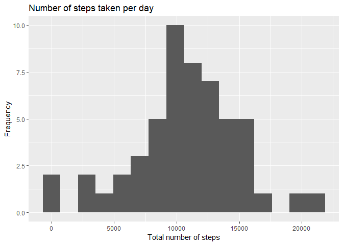
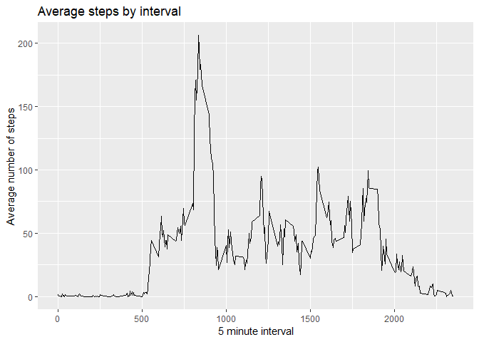
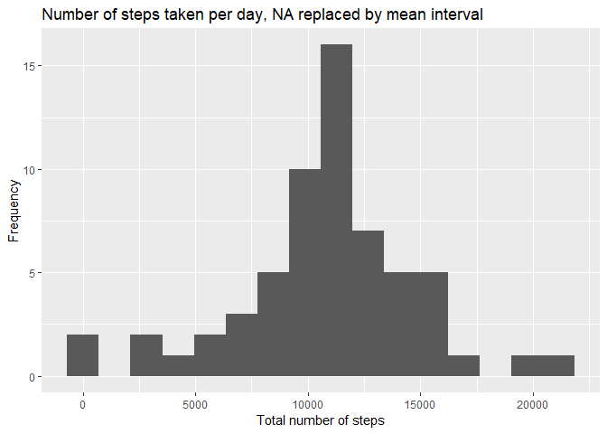
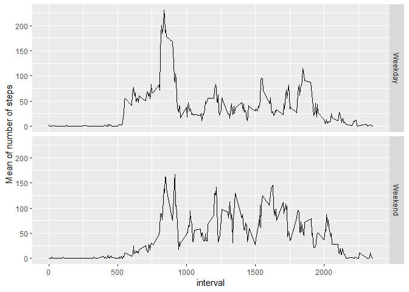

# Project course 1

## Introduction

The objective of this course project is to getting familiar with R markdown and knitr. Both are essential, but not the only tools, to make reproducible research. The project is part of the Data Science specialization in Coursera by the John Hopkins University.

## Loading and preprocessing the data

The first step to complete de project course is read the CSV file and, if necesary,  process the data. Also, we must load the packages that are used in the code.


```r
library(dplyr)
library(ggplot2)
library(lubridate)

unzip("activity.zip")
activity <- read.csv("activity.CSV")
activity <- tbl_df(activity)
activity$date <- ymd(activity$date)
activity <- mutate(activity, weekday = weekdays.Date(date))
```

We read the data and turn the date variable from `int` to `Date`. Now we are ready to begin with the exploratory analysis.


```r
str(activity)
```

```
## Classes 'tbl_df', 'tbl' and 'data.frame':	17568 obs. of  4 variables:
##  $ steps   : int  NA NA NA NA NA NA NA NA NA NA ...
##  $ date    : Date, format: "2012-10-01" "2012-10-01" ...
##  $ interval: int  0 5 10 15 20 25 30 35 40 45 ...
##  $ weekday : chr  "lunes" "lunes" "lunes" "lunes" ...
```

There are 4  variables and 17568 observations in the dataframe. If we look at the structure of the data, already know that there are at least a few missing values on it. Later we are going to solve this issue, but for now we can move forward into the exploratory analysis.

## What is mean total number of steps taken per day?

For this part of the assignment, we can ignore the missing values in the dataset. First, make a histogram of the total number of steps taken each day:


```r
act_for_hist <- group_by(activity, date)
hist <- summarise(act_for_hist, sum = sum(steps))
qplot(sum, data= hist, bins= 16, main= "Number of steps taken per day", xlab = "Total number of steps", ylab = "Frequency")
```

<!-- -->

Then, calculate and report the mean and median total number of steps taken per day:


```r
tot_steps_mean <- mean(hist$sum, na.rm = TRUE)
tot_steps_median <- median(hist$sum, na.rm = TRUE)
```

The mean and median total number of steps taken per day are 10766.19 and 10765.

## What is the average daily activity pattern?

Make a time series plot (i.e. type = "l") of the 5-minute interval (x-axis) and the average number of steps taken, averaged across all days (y-axis):


```r
ave_pat <- group_by(activity, interval)
apmean <- summarise(ave_pat, mean = mean(steps, na.rm = TRUE))

qplot(interval, mean, data = apmean, geom = "line", main = "Average steps by interval", xlab = "5 minute interval", ylab = "Average number of steps")
```

<!-- -->

Which 5-minute interval, on average across all the days in the dataset, contains the maximum number of steps?


```r
maxperday <- filter(apmean, mean == max(apmean$mean))
```

The interval 835 contain the maximum number of steps (206.1698113).

## Imputing missing values

Note that there are a number of days/intervals where there are missing values (coded as NA). The presence of missing days may introduce bias into some calculations or summaries of the data.

Calculate and report the total number of missing values in the dataset (i.e. the total number of rows with NAs):


```r
act.na <- is.na.data.frame(activity)
colSums(act.na)
```

```
##    steps     date interval  weekday 
##     2304        0        0        0
```

There are 2304 missing values in the step variable, 0 in date and 0 in interval.

For filling all the missing values in the dataset, we use the mean for that 5-minute interval:


```r
actmerge<- merge(activity, apmean, by= "interval")
actmerge$steps <- ifelse(is.na(actmerge$steps), actmerge$mean, actmerge$steps)
```

Make a histogram of the total number of steps taken each day:


```r
actgroup <- group_by(actmerge, date)
acthist <-summarise(actgroup, sum = sum(steps))

qplot(sum, data= acthist, bins= 16, main= "Number of steps taken per day, NA replaced by mean interval", xlab = "Total number of steps", ylab = "Frequency")
```

<!-- -->

Calculate and report the mean and median total number of steps taken per day:


```r
mean_wo_na <- mean(acthist$sum, na.rm = TRUE)
median_wo_na <- median(acthist$sum, na.rm = TRUE)
print(mean_wo_na)
```

```
## [1] 10766.19
```

```r
print(median_wo_na)
```

```
## [1] 10766.19
```

Do these values differ from the estimates from the first part of the assignment? What is the impact of imputing missing data on the estimates of the total daily number of steps?

Those values differ but probably it's not significant. If we use the mean to fill the NA values, we are going to have a more "central" results, closest to the mean (median from 10765 to 10766.19)

## Are there differences in activity patterns between weekdays and weekends?

Create a new factor variable in the dataset with two levels -- "weekday" and "weekend" indicating whether a given date is a weekday or weekend day:


```r
actfinal <- mutate(actmerge, wk = ifelse(actmerge$weekday == "sábado" | actmerge$weekday == "domingo", "Weekend", "Weekday"))
actfinal$wk <- as.factor(actfinal$wk)
```

Make a panel plot containing a time series plot of the 5-minute interval (x-axis) and the average number of steps taken, averaged across all weekday days or weekend days (y-axis):


```r
actfinal <- group_by(actfinal, wk, interval)
actsum <- summarise(actfinal, mean2 = mean(steps))

gg <- ggplot(data= actsum, aes(interval, mean2)) + geom_line()
gg + facet_grid(rows = vars(wk)) + ylab("Mean of number of steps")
```

<!-- -->

